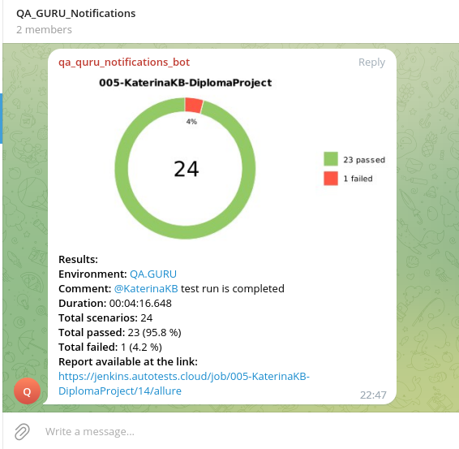

# Demo project for automation testing of Shadow Meadows
<p align="center">

</p>

##  Contents:

> ➠ [Technology stack](#Technology_stack)
>
> ➠ [Covered functionality](#covered_functionality)
>
> ➠ [Running tests from the terminal](#Running_tests)
>
> ➠ [Allure report](#allure_report)
>
> ➠ [Telegram Notification](#telegram_notification)
>
> ➠ [Selenoid Test Run example](#selenoid_run)
  
## Technology stack <a name="technology_stack"></a> 

<p align="center">
<a href="https://www.jetbrains.com/pycharm/"></a>
<a href="https://www.python.org/"></a>
<a href="https://aerokube.com/selenoid/"></a>
<a href="https://github.com/"></a>
<a href="https://github.com/allure-framework/allure2"></a>
<a href="https://www.jenkins.io/"></a> 
</p>

- Autotests were written in <code>Python</code> using <code>Selene</code> for UI tests.
- PageObject is used
- API methods are used in UI tests to speed up the tests
- <code>Allure Report</code> generates test run reports
- <code>Jenkins</code> runs the tests. 
- After the run is completed, notifications are sent using the bot to <code>Telegram</code>.

## Covered functionality <a name="сovered_functionality"></a> 

### UI
You can see Shadow Meadows web-site <a href="https://automationintesting.online/#">here</a>

Be aware that database resets every 10 minutes

- [x] Testing of booking creation
- [x] Testing of information in booking confirmation
- [x] Testing of total cost of booking
- [x] Testing of message sending

### API
You can see Shadow Meadows API <a href="https://automationintesting.online/auth/swagger-ui/index.html#/">for authentication</a> and <a href="https://automationintesting.online/booking/swagger-ui/index.html#/">for booking</a>

Be aware that database resets every 10 minutes

- [x] Testing of GET method for receiving information about booking
- [x] Testing of POST method for booking creation (including checking the content in response and schema validation)
- [x] Testing of DELETE method for booking removal

## </a> Jenkins <a target="_blank" href="https://jenkins.autotests.cloud/job/005-KaterinaKB-DiplomaProject/"> job </a> <a name="jenkins_job"></a> 
<p align="center">
<a href="https://jenkins.autotests.cloud/job/005-KaterinaKB-DiplomaProject/"></a>
</p>

##  Running tests from the terminal <a name="running_tests"></a> 
Local launch:
```
pytest ./tests
```

Only UI tests:
```
pytest ./tests/tests_ui
```

Only API tests:
```
pytest ./tests/tests_api
```

Report generation:
```
allure serve ./allure-results
```
## <a name="allure_report"></a>  </a> <a target="_blank" href="https://jenkins.autotests.cloud/job/005-KaterinaKB-DiplomaProject/11/allure/">Allure report</a>

###  Overview
<p align="center">

</p>


### Tests
<p align="center">

</p>


## <a name="telegram_notofocation"></a>  </a> Telegram Notification


<p align="center">

</p>

## <a name="selenoid_run"></a> Selenoid Test Run example
### </a> Video with test run</a>
<p align="center">

</p>